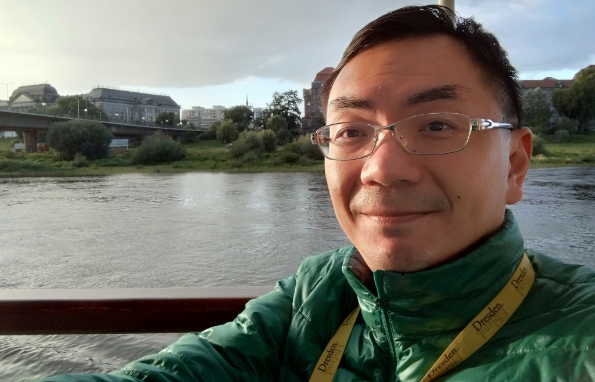

# Wei-Chen CHU 

## Profile
- I'm an Imaging Core Facility Manager and Bioimage Analyst passionate about empowering researchers to generate high-quality imaging data and develop reproducible analysis workflows. I teach confocal microscopy and bioimage analysis with FIJI and AI tools, equipping trainees with the skills to independently plan, acquire, and troubleshoot their experiments. As part of my commitment to open science, I develop and share open-access training materials. Beyond training, I design and implement custom bioimage analysis workflows and provide expert consultation for advanced imaging projects. 
- If you’re interested in collaboration, or consulting on bioimaging analysis projects, I’d love to connect.🙂

## Contact
- E-mail: [weichen01@as.edu.tw](mailto:weichen01@as.edu.tw)
- LinkedIn: [https://www.linkedin.com/in/weichen-chu/](https://www.linkedin.com/in/weichen-chu/)
- Bluesky: [@weichen01.bsky.social](https://bsky.app/profile/weichen01.bsky.social)
- X (Twitter): [@WeiChenCHU1](https://x.com/WeiChenCHU1)

## Professional Experience
- Imaging Core Facility, Institute of Cellular and Organismic Biology (ICOB), Academia Sinica, Taiwan
    - R&D Scientist  (Jan 2024 - Present)  
    - Project Scientist (Oct 2021 - Dec 2023)
    - Research Technical Employee (Sep 2021)
    - Postdocroal Researcher (May 2021- Aug 2021)

- RIKEN Center for Biosystems Dynamics Research (BDR), Japan  
    - Research Scientist (Sep 2017 - Mar 2021)
    - Visiting Scientist (Oct 2016 - Sep 2017)  
    Supported by Postdoctoral Research Abroad Program, Ministry of Science and Technology, Taiwan
    - Research Scientist (Jul 2015 - Sep 2016)

## Education
- Ph.D., Life Science  
Graduate Institute of Life Science, National Defense Medical Center, Taiwan  
- Master's, Life Science  
Department of Life Science, National Chung Hsing University, Taiwan 
- Bachelor's, Life Science  
Department of Life Science, National Chung Hsing University, Taiwan

## Core Skills
- Confocal Microscopy/ Fluorescence microscopy
- Immunofluorescence, fluorescence protein tagging
- Bio-Image processing and analysis using FIJI/ ImageJ, Napari and Imaris
- GPU-accelerated image processing libraries (CLIJ series in FIJI, clEsperanto in Python)
- Developing custom image processing and analysis workflows using ImageJ Macro or Python

## Membership Affiliations
- [EABIAS: East Asia Bioimage Analysts’ Society](https://eabias.github.io/)
    - Founding member
    - Website maintainer 
- [GloBIAS: Global BioImage Analysts' Society](https://www.globias.org/)
    - Ordinary member
- [QUAREP-LiMi: Quality Assessment and Reproducibility for Instruments & Images in Light Microscopy](https://quarep.org/)
    - Member

## Honors & Awards
- Outstanding Employee 2024, Academia Sinica, Taiwan  
(113年中央研究院工作績優人員)
- Drosophila Image Award 2022: Honorable Mention
- RIKEN Incentive Project FY2018
- Postdoctoral Research Abroad Program 2016, Ministry of Science and Technology, Taiwan

## Attended Bioimage Analysis Training Course

- In-person attendance:  
    - [PoL Bio-Image Analysis Training School 2023 (Early Career Track)](https://biapol.github.io/PoL-BioImage-Analysis-TS-Early-Career-Track/intro.html) 
          - NEUBIAS-Style Training School, TU Dresden, Germany
          - Selected attendance, travel supported by ICOB, Academia Sinica, Taiwan.
    
- Online attendance:  
    - [YMIA Python-Based Event Series 2024](https://gerbi-gmb.de/teams/ymia/)  
    (Young Microscopists and Image Analysts, German Bioimaging)

    - [VMCF Bioimage Analysis and Data Processing Workshop 2024-2025](https://biapol.github.io/BioImage-Analysis-and-Data-Processing-Workshop-2025/intro.html)  
  (Viničná Microscopy Core Facility, Charles University, Czechia)

    - [BOMP Fundamentals of Fluorescence Microscopy 2024-2025](https://microscopy.unimelb.edu.au/om/capabilities/workshops-resources)  
  (Biological Optical Microscopy Platform, University of Melbourne)

    - [LIBRE hub: Image data science with Python and Napari 2023](https://librehub.github.io/napari-LatAm-workshop-2023/intro.html#)

## Organizing Bioimage Analysis Traing Course

- ICOB imaging Core summer imaging workshops
    - [ICOB core YouTube Playlist](https://www.youtube.com/@icobcore/playlists)

- EABIAS Training event:
    - [Python for Bioimage Analysis -Watch Party & Discussion](  
https://docs.google.com/document/d/14mRHf7DGSZsFjaJhhjdbVZDhxe5GPa-8wV1EXQE5PuI/edit?usp=sharing)

    - [ImageJ 顯微影像分析與程式設計](https://github.com/EABIAS/2025-ImageJ-Micro-Image-Analysis-and-Programming_Taipei)

## Open-Access Training Materials
- Bioimage Analysis with FIJI and AI tools (@ICOB Summer Bioimaging Workshop 2025)
    - Slide in English: [https://doi.org/10.5281/zenodo.15910878](https://doi.org/10.5281/zenodo.15910878)  
    - YouTube Recording (Mandarin): [https://youtu.be/qE78Yqv3UxI](https://youtu.be/qE78Yqv3UxI)

- Bioimage Analysis with FIJI and AI tools (@TIGP‐INS Neuro‐imaging workshop 2025)  
    - Slide in English: [https://doi.org/10.5281/zenodo.15588682](https://doi.org/10.5281/zenodo.15588682)    
    - YouTube Recording (English): [https://youtu.be/nVYhvsN7Jyg](https://youtu.be/nVYhvsN7Jyg)

- Interactive Bioimage Analysis Workflow with CLIJ (@EABIAS 2025 training event)  
    - Zendo [https://doi.org/10.5281/zenodo.15070246](https://doi.org/10.5281/zenodo.15070246)   
    - YouTube Recording (Mandarin): [https://youtu.be/uheSMSENnzE](https://youtu.be/uheSMSENnzE)

- Introducing to Licensing for Documents and Code (@EABIAS 2025 training event)
    - Slide in English: [GitHub links](https://github.com/EABIAS/2025-ImageJ-Micro-Image-Analysis-and-Programming_Taipei/blob/main/Lesson_07_Workflow/Lesson_07_Licensing_20250428_v1p1.pdf)  
YouTube Recording (Mandarin): [https://youtu.be/iGVps1Qazmo?list=PL_9oCBBWdG8mLVflK-MJ3YkUPmhwpKO1s&t=4945](https://youtu.be/iGVps1Qazmo?list=PL_9oCBBWdG8mLVflK-MJ3YkUPmhwpKO1s&t=4945)

- Open source AI Tools for bioimage analysis workshop (@ICOB Summer Bioimaging Workshop 2024)  
    - Slide in English:  [https://doi.org/10.5281/zenodo.13284351](https://doi.org/10.5281/zenodo.13284351)  
    - YouTube Recording (Mandarin): [https://youtu.be/KqwssouW0G0](https://youtu.be/KqwssouW0G0)

- Bioimage Analysis with FIJI /ImageJ & Friends workshop (@ICOB Summer Bioimaging Workshop 2024)  
    - Slide in English: [https://doi.org/10.5281/zenodo.12803966](https://doi.org/10.5281/zenodo.12803966)  
    - YouTube Recording (Mandarin): [https://youtu.be/rMRV2N81fkM](https://youtu.be/rMRV2N81fkM)  

- Bioimage Analysis with FIJI /ImageJ Workshop (@ICOB Summer Bioimaging Workshop 2023)  
    - Slide in English: [https://doi.org/10.5281/zenodo.12736727](https://doi.org/10.5281/zenodo.12736727)    
    - YouTube Recording (Mandarin): [https://youtu.be/cnfW9vPQ_XI](https://youtu.be/cnfW9vPQ_XI)

## Open-Source Bioimaging Analysis Workflows / Tools
- [Cell_Dist_Mesh_Generator](https://github.com/WeiChenChu/Cell_Dist_Mesh_Generator)  
This repository hosts a FIJI/ImageJ macro tailored for the automated generation of distance meshes between cells, aiding in quantitative visualization.

- [central-nuclei-muscle-analyzer](https://github.com/WeiChenChu/central-nuclei-muscle-analyzer)  
A comprehensive ImageJ macro for automated analysis of nuclear localization in muscle cross-sectional areas, specifically designed to identify and quantify central nuclei in muscle fibers.

- [IJ_Hot_LUTs_palette](https://github.com/WeiChenChu/IJ_Hot_LUTs_palette)  
This repository provides color palettes (.pal files) for Imaris, with a special focus on the popular "Hot" series of Look-Up Tables (LUTs) from ImageJ/Fiji. These LUTs are excellent for visualization.

## Publications  
- ORCID: [https://orcid.org/0000-0002-3447-9043](https://orcid.org/0000-0002-3447-9043)
- GitHub: [https://github.com/WeiChenChu](https://github.com/WeiChenChu)