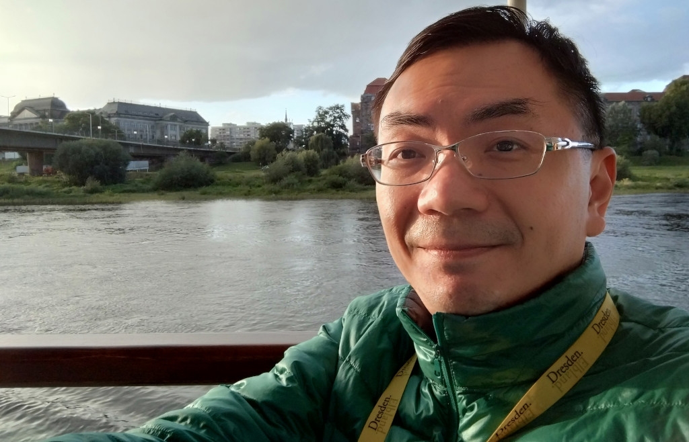

Imaging Core Support | Bioimage Analysis | Open Training

# Wei-Chen Chu (朱韋臣), Ph.D.

R&D Scientist at the ICOB Imaging Core, Academia Sinica. I support microscopy
planning, acquisition, quantitative image analysis, visualization, and
reproducible workflows.

## Connect

- Email: [weichen01@as.edu.tw](mailto:weichen01@as.edu.tw)
- GitHub: [github.com/WeiChenChu](https://github.com/WeiChenChu)
- ORCID: [0000-0002-3447-9043](https://orcid.org/0000-0002-3447-9043)
- LinkedIn: [linkedin.com/in/weichen-chu](https://www.linkedin.com/in/weichen-chu/)
- Bluesky: [@weichen01.bsky.social](https://bsky.app/profile/weichen01.bsky.social)
- X: [@WeiChenCHU1](https://x.com/WeiChenCHU1)

<figure class="photo-panel">

<figcaption>Wei-Chen Chu | ICOB Imaging Core</figcaption>
</figure>

<ul class="profile-topics" aria-label="Primary methods and tools">
  <li>Confocal microscopy</li>
  <li>FIJI/ImageJ</li>
  <li>napari</li>
  <li>Imaris</li>
  <li>Python</li>
  <li>GPU workflows</li>
</ul>

## Explore the Site

<nav class="section-links" aria-label="Main website sections">
<a href="about/">
<strong>About</strong>
Experience, education, honors, community roles, and profile links.
</a>
<a href="expertise/">
<strong>Imaging Support</strong>
Microscopy planning, acquisition support, analysis, and reproducible workflow development.
</a>
<a href="training/">
<strong>Training</strong>
Courses, workshops, recordings, slides, and continuing professional development.
</a>
<a href="workflows-tools/">
<strong>Workflows</strong>
Open-source repositories for practical microscopy analysis problems.
</a>
</nav>

